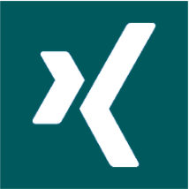

# David Krentzlin

> Keep learning. Show up. Do the work. Finish strong.

With 20 years in the field, I eat, sleep, and breathe code. I know how to approach complex systems and build components that meet today’s demands.
I am comfortable being both a leader and a follower.

In the end, it’s about people, communication, and relations - occasionally about technology. 

## Projects

All the projects I have on GitHub are for my personal educational purposes. That’s the usual disclaimer to say that they’re in development and even though I try to keep the main branch functional at all times, it may contain code that’s incomplete or wrong.

I’m working on the following projects:

* **[cl-braces](https://github.com/certainty/cl-braces)** *a golang compiler and virtual machine in the making - Common Lisp*
* **[1brc](https://github.com/certainty/1brc)** *The [1 billion row challenge](https://github.com/gunnarmorling/1brc), to see if I can solve it in acceptible time in Common Lisp*
* **[agol](https://github.com/certainty/alien-game-of-life)** *Conway's game of life - Common Lisp*
* **[braces](https://github.com/certainty/braces)** *a scheme compiler and virtual machine - Rust*

## Professional

I’m a backend guy and have worked on many services and platforms during my career.  

I think it’s fair to say that I’m much better at building infrastructure, platforms and developer tooling, than user-facing products. As it’s quite common in our industry, I’ve gone into management, stayed there for a while, and circled back into an IC role. I have learned a ton in each of those areas and like to think that this made me overall well-rounded. I enjoy learning new things, and exploring new areas, which I can approach with
a beginner's mindset. If found that this keeps me grounded, humble and engaged. 

Head over to my **[CV](https://david.krentzlin.me/cv)** for all the details, or look at my three most recent positions here:

* **Senior Software Architect** at [New Work SE](https://www.new-work.se/en), supporting the cloud platform team. 
* **Tech Lead** at [Hive Technologies](https://www.hive.app/), supporting the delivery & end-customer experience team.
* **Team Lead Architecture** at [New Work SE](https://www.new-work.se/en), leading the API platform team that built and operated the GraphQL platform.

## Talks

I gave talks on various local meetups. In 2018 I gave a talk at the GraphQL EU on how my team built our GraphQL platform.

  

  

## Get in contact with me

